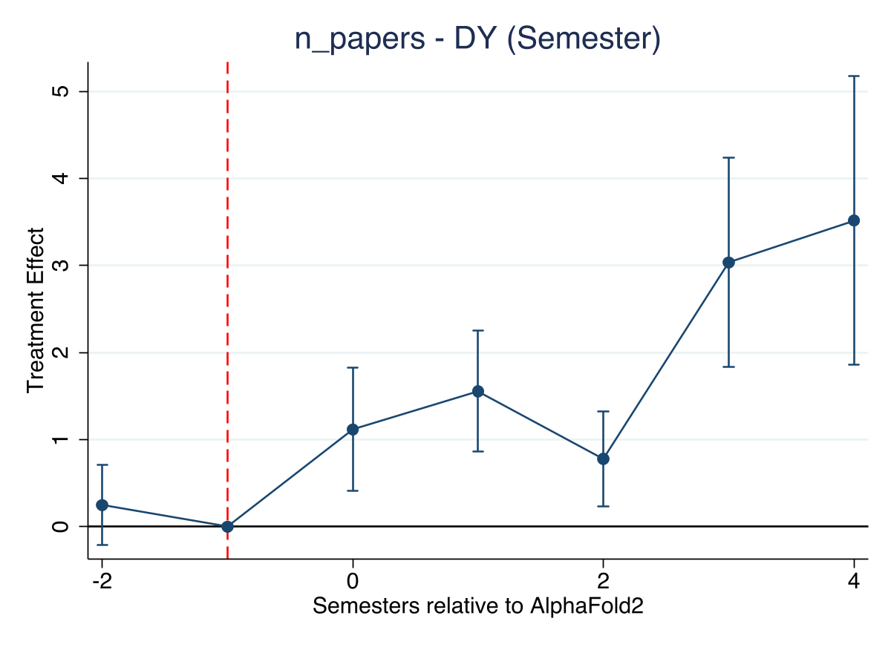
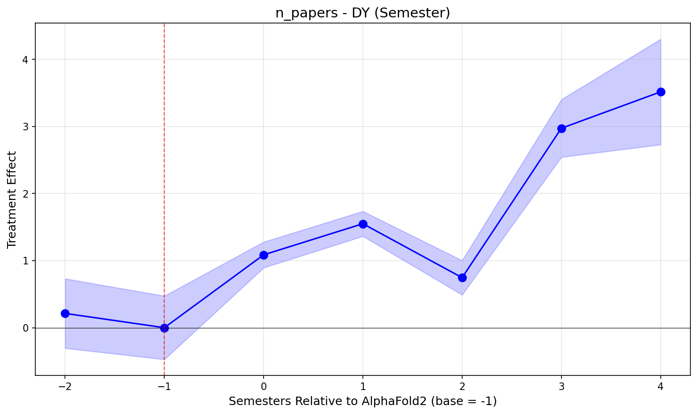
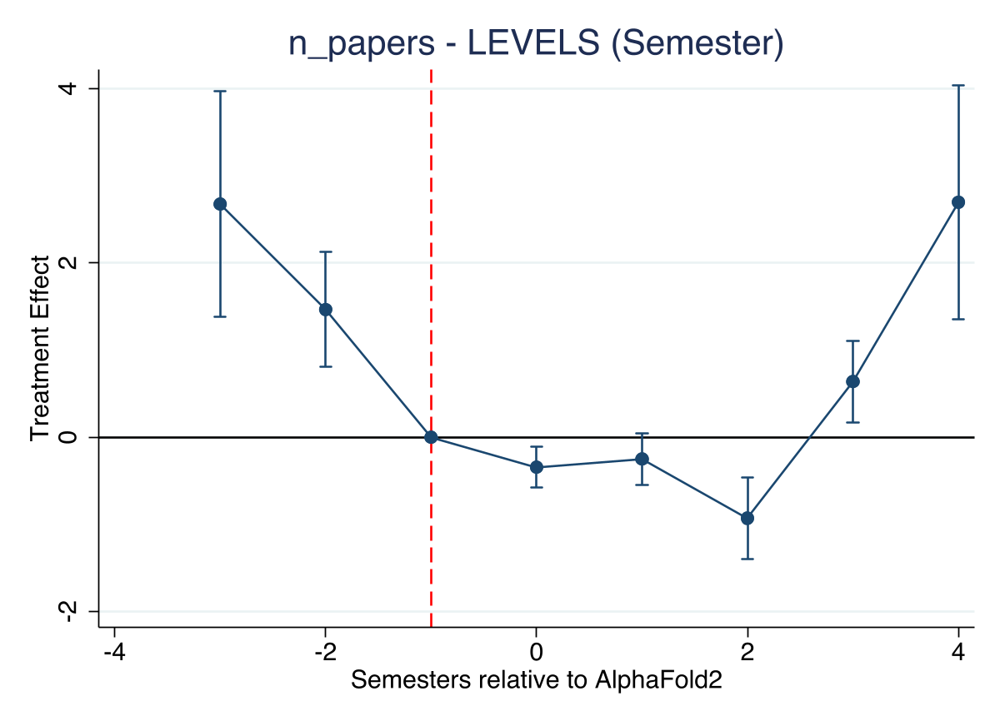

# Stata Pipeline Walkthrough

Quick reference for key lines of code in each step.

---

## Step 1: CEM Matching (`01_cem_matching.do`)

### Treatment Definition
```stata
gen byte treated = (num_deposits == 0)
```
Genes with NO prior PDB deposits = treated (AF2 is their first structural info).

### Time Variables
```stata
gen int semester = floor((ym_seq - 1) / 6)
gen int rel_semester = semester - `treatment_semester'
```
Groups months into semesters. `rel_semester = 0` is July-Dec 2021 (AF2 release).

### Pre-Treatment Features (strictly before treatment)
```stata
keep if ym_seq < `treatment_seq'

collapse (mean) pre_mean_papers = n_papers ///
         (mean) pre_mean_newcom = n_newcomer_papers ///
         (mean) pre_mean_veteran = n_veteran_papers ///
         (mean) pre_mean_top10 = n_top10_y ///
         (sd)   pre_sd_papers = n_papers, ///
         by(gene_id)
```
For each gene, compute average publication stats from the pre-period only. These become the matching variables.

### CEM Matching
```stata
xtile cem_pre_mean_papers = pre_mean_papers, nq(10)
```
Bin each variable into 10 quantiles.

```stata
cem cem_pre_mean_papers cem_pre_mean_newcom cem_pre_mean_veteran ///
    cem_pre_mean_top10 cem_pre_sd_papers, treatment(treated)
```
**This is the key matching line.** CEM creates exact strata from the binned variables, drops strata without both treated and control, and computes weights.

**NOTE:** No pLDDT here. Matteo said to remove it (it's generated by AF2, doesn't exist pre-treatment).

```stata
keep if cem_matched == 1
gen double cem_weight = cem_weights
```
Keep only matched genes. `cem_weights` balances treated vs control within strata.

### Merge Back to Panel
```stata
merge m:1 gene_id using "derived/matched_genes.dta", keep(match) nogen
```
`m:1` = many-to-one. Many panel rows (gene-months) merge to one row of gene-level weights. `keep(match)` drops unmatched genes.

### Collapse to Semester
```stata
collapse (sum) n_papers n_newcomer_papers n_veteran_papers n_top10_y ///
         (first) treated cem_weight ..., ///
         by(gene_id semester)
```
Sum up paper counts within each semester. Gene-level vars (treated, weight) take first value.

### Delta Y Variables
```stata
sort gene_id semester
by gene_id: gen double D_n_papers = n_papers - n_papers[_n-1]
```
`[_n-1]` = previous row. Within each gene (because of `by gene_id`), this computes the change from last semester to this semester. **This is the ΔY that makes pre-trends "flat."**

```stata
gen double asinh_n_papers = asinh(n_papers)
```
`asinh` = inverse hyperbolic sine. Like log but handles zeros. Used as an alternative transformation.

---

## Step 2: Event Study (`02_event_study.do`)

### The Key Regression
```stata
reghdfe `varlist' ib`base'.rel_sem_fv##i.treated [aw=cem_weight], ///
    absorb(gene_id semester) vce(cluster gene_id)
```

Breaking this down:
- `reghdfe` = regression with high-dimensional fixed effects (like `areg` but better)
- `ib`base'.rel_sem_fv##i.treated` = interact each semester dummy with treatment dummy, omitting the base period
- `[aw=cem_weight]` = use CEM weights (analytical weights)
- `absorb(gene_id semester)` = gene fixed effects + semester fixed effects (absorbed, not estimated)
- `vce(cluster gene_id)` = cluster standard errors at gene level

**This is the TWFE (two-way fixed effects) event study.** The coefficients on `1.treated#k.rel_sem_fv` are the DiD effects at each period k.

### Extracting Coefficients
```stata
local b = _b[1.treated#`k'.rel_sem_fv]
local se = _se[1.treated#`k'.rel_sem_fv]
```
`_b[]` = coefficient estimate, `_se[]` = standard error. `1.treated#3.rel_sem_fv` means "the interaction of treated=1 with period=3."

### Factor Variable Trick
```stata
gen int rel_sem_fv = rel_semester - `min_sem'
```
Stata factor variables (`i.` and `ib().`) can't handle negative values. So we shift everything to be non-negative, then shift back when exporting.

### The Three Specifications
```stata
* LEVELS: raw paper count
run_eventstudy n_papers, spec("LEVELS") ...

* DY: first difference (the "preferred" one)
run_eventstudy D_n_papers, spec("DY") ...

* DASINH: change in asinh(papers)
run_eventstudy D_asinh_n_papers, spec("DASINH") ...
```
Same regression, different dependent variable. **DY is the one Danilo says "works"** because it flattens pre-trends.

---

## Step 3: Diagnostics (`03_diagnostics.do`)

### Raw Means (What the Data Actually Looks Like)
```stata
qui sum n_papers if rel_semester == `s' & treated == 1 [aw=cem_weight]
local t = r(mean)
```
Weighted mean papers for treated genes at each period. This shows you the actual curves, not regression coefficients.

### Percentage Changes (The Honest Check)
```stata
local pct_t = 100 * (`t' - `prev_t') / `prev_t'
local pct_c = 100 * (`c' - `prev_c') / `prev_c'
```
If treated and control have similar % changes, the curves have the **same shape just scaled**. This means the ΔY "effect" is mechanical - it's just comparing absolute changes between groups of very different sizes.

### Simple DiD (Sanity Check)
```stata
local did = (`post_t' - `pre_t') - (`post_c' - `pre_c')
```
Back-of-envelope DiD. If this disagrees with the regression, something is off.

---

## Key Merges Summary

| Merge | Type | What It Does |
|-------|------|-------------|
| `pre_features → gene_level` | 1:1 on gene_id | Attach pre-treatment stats to each gene |
| `matched_genes → panel_base` | m:1 on gene_id | Attach CEM weights to all rows for matched genes |

---

## Key Variables Cheat Sheet

| Variable | Meaning |
|----------|---------|
| `treated` | 1 = no PDB deposits (AF2 is new info) |
| `rel_semester` | Event time: -3 to +4, 0 = AF2 release |
| `rel_sem_fv` | Same but shifted non-negative (for Stata factors) |
| `cem_weight` | CEM matching weight |
| `n_papers` | Total papers per gene-semester |
| `D_n_papers` | Change from previous semester (ΔY) |
| `asinh_n_papers` | asinh(papers) - like log but handles zeros |
| `D_asinh_n_papers` | Change in asinh (Δasinh) |

---

## Results

### Event Study Figures (DY Specification - "Preferred")

**Stata:**


**Python:**


Both show the same pattern: flat pre-trend, positive post-effect that grows over time.

### Event Study Figures (LEVELS Specification)

**Stata:**


Levels shows a different story - pre-trend violations and no clear positive effect.

---

### Coefficient Comparison: Danilo vs Our Stata vs Our Python

**DY Specification, n_papers (the main result):**

| Period | Danilo (Stata) | Our Stata | Our Python |
|--------|---------------|-----------|------------|
| -2 | 0.0064 | 0.2572 | 0.2127 |
| -1 | 0.0000 | 0.0000 | 0.0000 |
| 0 | 0.0108 | 1.1198 | 1.0857 |
| 1 | 0.0489 | 1.5548 | 1.5492 |
| 2 | 0.0308 | 0.7857 | 0.7456 |
| 3 | 0.0517 | 3.0242 | 2.9722 |
| 4 | 0.1991 | 3.5162 | 3.5146 |

**Our Stata vs Python: within ~5% of each other. Consistent.**

**Our vs Danilo: ~10-20x magnitude difference.** Likely because different matched samples (our CEM matched slightly differently than his - different random seed, package version, or his sample may have different genes). Qualitative pattern is the same.

**DY Specification, n_newcomer_papers:**

| Period | Danilo | Our Stata | Our Python |
|--------|--------|-----------|------------|
| -2 | -0.0004 | 0.2812 | 0.2406 |
| -1 | 0.0000 | 0.0000 | 0.0000 |
| 0 | -0.0055 | 0.7472 | 0.7184 |
| 1 | 0.0335 | 1.0676 | 1.0628 |
| 2 | 0.0110 | 0.2973 | 0.2649 |
| 3 | 0.0203 | 2.1498 | 2.1084 |
| 4 | 0.1295 | 2.1462 | 2.1498 |

**DY Specification, n_veteran_papers:**

| Period | Danilo | Our Stata | Our Python |
|--------|--------|-----------|------------|
| -2 | 0.0068 | -0.0241 | -0.0279 |
| -1 | 0.0000 | 0.0000 | 0.0000 |
| 0 | 0.0163 | 0.3726 | 0.3673 |
| 1 | 0.0154 | 0.4871 | 0.4864 |
| 2 | 0.0198 | 0.4884 | 0.4807 |
| 3 | 0.0314 | 0.8744 | 0.8639 |
| 4 | 0.0697 | 1.3700 | 1.3649 |

**DY Specification, n_top10_y:**

| Period | Danilo | Our Stata | Our Python |
|--------|--------|-----------|------------|
| -2 | 0.0239 | 0.3695 | 0.3789 |
| -1 | 0.0000 | 0.0000 | 0.0000 |
| 0 | 0.0238 | 0.7819 | 0.8054 |
| 1 | -0.0009 | -0.2529 | -0.2561 |
| 2 | 0.0326 | 0.9980 | 0.9949 |
| 3 | -0.0077 | 0.1096 | 0.1146 |
| 4 | 0.0664 | 1.4715 | 1.4732 |

---

### DiD Summary (from Stata Diagnostics)

```
LEVELS (Y):
  Treated: 23.8 → 25.8 (change: +2.0)
  Control: 31.1 → 33.5 (change: +2.4)
  DiD: -0.4  ← NEGATIVE (control grew more)

DELTA Y (first differences):
  Treated: 3.79 → -1.90 (change: -5.69)
  Control: 5.13 → -2.43 (change: -7.56)
  DiD: +1.88  ← POSITIVE (control decelerated more)
```

**Same data, opposite conclusions.** Levels says null/negative. DY says positive. The difference is what "effect" means:
- Levels: did treated genes accumulate more papers? **No.**
- DY: did treated genes decelerate less? **Yes.** But both groups decelerated.

---

### Raw Trends (from Stata Diagnostics)

```
n_papers (weighted mean per gene-semester):

Period   Treated    Control    Gap     Treated/Control
  -3       20.3       26.1     5.9       77.5%
  -2       23.6       30.7     7.1       76.9%
  -1       27.9       36.4     8.5       76.6%
   0       28.0       36.9     8.9       76.0%
   1       28.0       36.8     8.8       76.0%
   2       29.1       38.6     9.5       75.5%
   3       25.4       33.4     7.9       76.3%
   4       18.4       24.2     5.9       75.8%
```

**Treated/Control ratio stays ~76% throughout.** The curves have the same shape, just scaled. The ΔY "effect" comes from absolute differences in a proportional decline.

---

## Calendar Mapping

| rel_semester | Calendar | Notes |
|-------------|----------|-------|
| -3 | Jan-Jun 2020 | COVID starts |
| -2 | Jul-Dec 2020 | COVID peak |
| -1 | Jan-Jun 2021 | Pre-AF2 (BASE PERIOD) |
| 0 | Jul-Dec 2021 | AF2 released |
| 1 | Jan-Jun 2022 | |
| 2 | Jul-Dec 2022 | |
| 3 | Jan-Jun 2023 | |
| 4 | Jul-Dec 2023 | DATA TRUNCATION |
